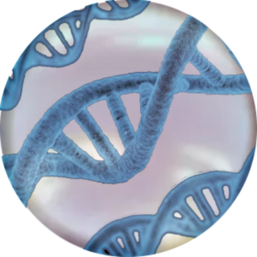

# Data DNA online
 Genealogical data online multi platform

## Документация
Пользовательскую документацию можно получить по [этой ссылке](./docs/ru/index.md).

[Релизы программы]: https://github.com/dvpt1/Data-DNA/releases

## Поддержка
Если у вас возникли сложности или вопросы по использованию пакета, создайте 
[обсуждение](https://github.com/dvpt1/DNADataOnline/issues/new/choose) в данном репозитории или напишите на электронную почту <dvpt@narod.com>.

## Зависимости
Эта программа зависит от интепретатора PHP версии 5.7 или выше. Если вы заметили, что он данное ПО можно запустить на версии ниже, или он не работает на какой-либо версии, то напишите в [поддержку](https://github.com/dvpt1/DNADataOnline#поддержка)

## Что доступно в Oxygen?
На данный момент в библиотеке Oxygen доступны только некоторые химические функции
