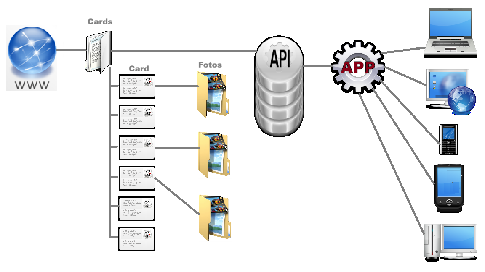

 Генеалогия семьи онлайн 

# Генеалогия семьи онлайн

MenuLeft()

## Платформа

### О платформе

#### Платформа "Генеалогия семьи онлайн" (далее платформа) это виртуальное семейная база информации, где каждый может участвовать в ее накоплении и обновлении из любой точки Мира. Вся информация хранится на вашем семейном сайте в генеалогических карточках в папке (картотеке) CARDS. В не хранятся карточки членов семьи в файлах .card (например 000001.card, 000002.card и т.д.). В папке Fotos в подпапках (например 000001, 000002 и т.д.) хранятся фотографии и копии документов персон. Платформа представляет из себя веб-интерфейс для доступа к базе данных из Интернет бройузеров. Для работы с платформой из приложений в операционых системах Windows, Mac OS, iOS, Android предназначен API встроенный в платформу.  
  
Схема путешествия информации в платформе, а также места обработки и представления пользователю в наших приложениях:

Представьте себе, что ваша бабушка из Канады с легкостью добавляет информацию о своих родителей, а дядя из России делится воспоминаниями о детстве, а внучатый племянник в Турции узнает о своих корнях, исследуя детальную карту миграции семьи. Больше не нужно хранить пыльные альбомы, пересылать сканированные фотографии и вести бесконечные переписки. Все это вы можете собрать в своем безопасном и удобном месте.

#### Платформа предлагает интуитивно понятный интерфейс, который позволит даже начинающему пользователю создать и наполнить генеалогическое древо. Вы сможете добавлять биографии, фотографии, копии документов,видеозаписи и любые другие материалы, которые помогут воссоздать полную картину жизни ваших предков.

#### Кроме того, платформа предоставляет мощные инструменты для поиска и сопоставления данных. Вы сможете находитьродственников, о которых раньше не знали, исследовать исторические записи и документы, а также связываться с другими исследователями генеалогии, чтобы обмениваться информацией и опытом.

#### Создайте свой семейный архив уже сегодня и подарите своим потомкам бесценное наследие – историю их семьи. Пусть поколения будут связаны не только кровью, но и общей памятью, доступной в любой точке Мира.

#### В эпоху стремительной цифровизации наша жизнь все больше переплетается с виртуальным миром. Фотографии, видео, документы, переписки, аккаунты в социальных сетях – все это формирует наше цифровое «я», которое, подобно реальному наследию, передается из поколения в поколение. Но как сохранить и передать это цифровое наследие, чтобы оно не исчезло в пучине информации?  
  
Одним из важнейших аспектов сохранения цифрового наследия является его систематизация. Необходимо создать четкую структуру хранения файлов, используя папки и подпапки, логически отражающие хронологию событий и тематику материалов. Важно также выбрать надежные облачные хранилища или внешние жесткие диски для резервного копирования данных, чтобы избежать потери информации в случае поломки оборудования или хакерских атак.  
  
Не менее важным является вопрос доступа к цифровому наследию после ухода из жизни. Необходимо заранее предусмотреть этот момент, оставив четкие инструкции и пароли для доверенных лиц, которые смогут получить доступ к аккаунтам в социальных сетях, электронной почте и другим онлайн-сервисам. Возможно, стоит рассмотреть возможность создания цифрового завещания, в котором будут прописаны правила управления цифровыми активами.  
  
Цифровое наследие семьи – это не только фотографии и документы. Это история нашей жизни, запечатленная в цифровом формате. Это воспоминания, которые мы хотим передать нашим потомкам. Заботясь о сохранении и передаче этого наследия, мы обеспечиваем связь между поколениями и сохраняем память о тех, кто был до нас. Это наша ответственность перед будущим.

  

Copyright © Konyuhov D.L.